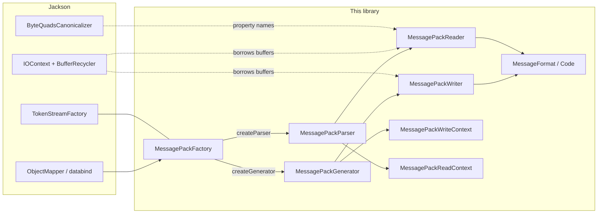
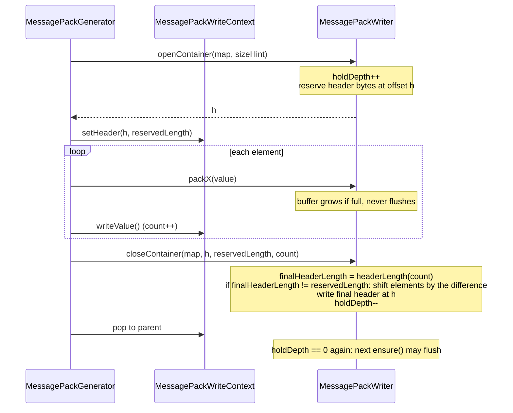
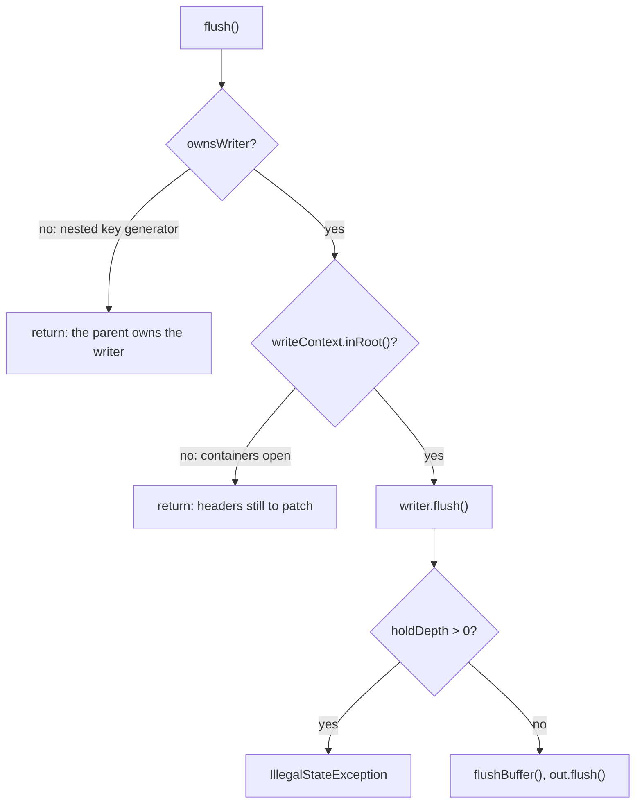
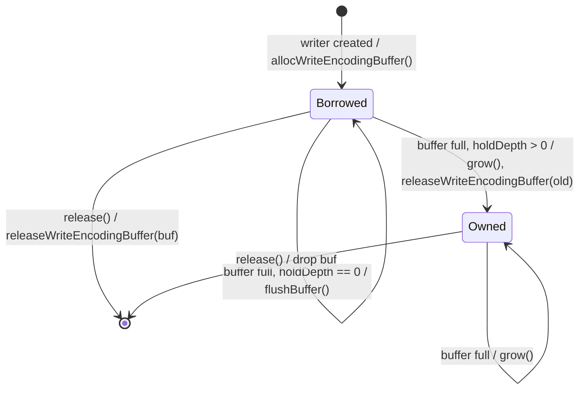
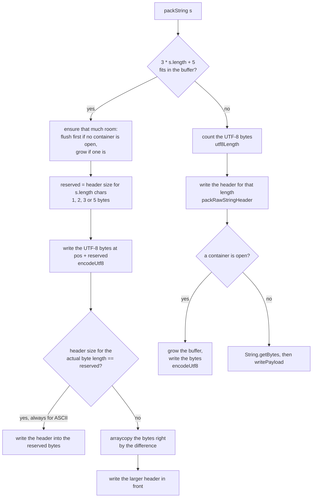
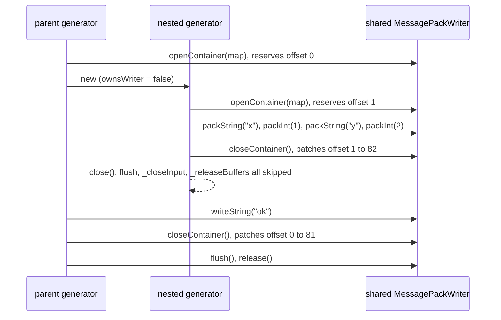
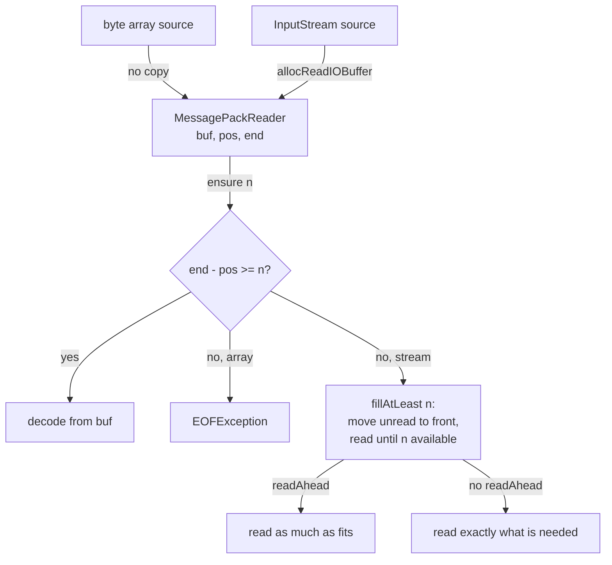
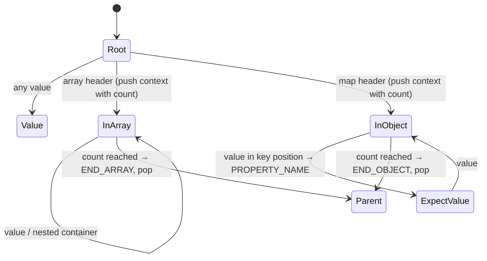

# Internal design

How the library encodes and decodes MessagePack on top of Jackson 3's streaming API. This is
for people changing the code; the README covers usage.

## 1. Class map



| Class | Role |
|---|---|
| `MessagePackFactory` / `MessagePackFactoryBuilder` | Jackson `TokenStreamFactory`. Owns the root symbol table and the format options (str8, integer keys, custom extension deserializers). |
| `MessagePackGenerator` | Jackson `JsonGenerator`. Maps write calls to writer calls and tracks the write context. |
| `MessagePackWriter` | Encodes values into a byte buffer and writes it to the `OutputStream`. Knows nothing about Jackson tokens. |
| `MessagePackWriteContext` | Jackson `TokenStreamContext` for writing: element counts, property-name state, header position of each open container. |
| `MessagePackParser` | Jackson `JsonParser`. Turns decoded values into tokens and holds the current value. |
| `MessagePackReader` | Decodes values from a byte array or an `InputStream` through a buffer. |
| `MessagePackReadContext` | Jackson `TokenStreamContext` for reading: expected element counts, current name. |
| `MessageFormat` / `Code` | The format-byte table of the MessagePack spec. |
| `MessagePackKeySerializer`, `MessagePackSerializedString` | Non-String map keys on the write side. |
| `TimestampExtensionModule`, `MessagePackExtensionType`, `ExtensionTypeCustomDeserializers` | Extension type (-1 timestamp, and user-defined types). |

msgpack-core is not used at runtime. It is a test dependency, used as the reference
implementation that every encoded and decoded value is compared against.

## 2. Write path

### 2.1 The problem: counted containers

A MessagePack array or map header carries the element count and precedes the elements.
Jackson's streaming API delivers elements one by one and only signals the end with
`writeEndArray`/`writeEndObject`. So the header cannot be final until the container closes,
and the bytes between the header and the close must still be in memory to patch it.

CBOR and Smile do not have this problem (CBOR has indefinite-length containers with a break
marker, Smile has start/end markers), which is why Jackson's own binary generators stream
every byte straight out and this one cannot.

### 2.2 Hold mode and header patching

`MessagePackWriter` keeps one output buffer. While no container is open, the buffer is
flushed to the stream whenever it fills. While a container is open (`holdDepth > 0`), the
buffer is never flushed; it grows instead, so the header stays reachable.



With no size hint, one byte is reserved (fixarray/fixmap, up to 15 elements). If the final
count needs a 3- or 5-byte header, the elements are shifted right once at close. With a size
hint (`writeStartArray(Object, int)`), the header for that size is written immediately and
close only patches it if the hint was wrong. Hints come from databind for collections of
known size and are used but not trusted: databind passes -1 when views or filters are
involved, and callers can be wrong.

### 2.2.1 Where the header is

`openContainer` returns the buffer offset at which it reserved the header, and the generator
stores it in the container's `MessagePackWriteContext` together with the number of bytes
reserved (`setHeader(offset, reservedLength)`). The count itself is not stored anywhere in
the buffer until close; the context counts elements as they are written
(`getEntryCount()`), and `closeContainer` gets all three from the context.

The offset is an index into the writer's buffer, and it stays valid for the whole time the
container is open because:

- the buffer is never flushed while `holdDepth > 0`, so bytes never move to the stream and
  offsets are never reset to 0;
- `grow()` copies the buffer from index 0 into the larger array, so every offset is the same
  in the new buffer;
- closing an inner container only shifts bytes *after* its own header, and every enclosing
  container's header lies before it, so outer offsets are unaffected;
- a nested generator for a complex map key shares the same writer and the same buffer, so
  its offsets are in the same index space.

Nested containers therefore just nest: each level's context holds its own offset, and
`holdDepth` counts open levels. Everything from the outermost open container's header
onward is in the buffer until that container closes; then `holdDepth` drops to 0 and the
next `ensure()` may flush.

### 2.2.2 When a flush is allowed

`flush()` is public API and databind calls it between values, so it can arrive while a
container is open:

```java
gen.writeStartObject();
gen.writeName("a");
gen.writeNumber(1);
gen.flush();            // here
```

At that moment the buffer holds:

```
offset   0    1    2    3
       +----+----+----+----+
       | ?? | a1 | 61 | 01 |
       +----+----+----+----+
         ^     \------------/
         |       "a": 1
         reserved for the map header; the entry count is still unknown
```

Writing those four bytes to the stream would send an unpatched header byte, and the mistake
could not be repaired afterwards because the bytes are already gone.

A flush can also arrive from a generator that is at root and still must not flush. A POJO
map key is written by a nested generator that shares the writer (see 2.6), and when the key
is finished try-with-resources closes it. `close()` flushes when its context is at root, and
it is at root: it opened and closed its own map. The parent's map stays open, but the nested
generator's context stack cannot see it:

```
offset   0    1    2    3    4    5    6    7
       +----+----+----+----+----+----+----+----+
       | ?? | 82 | a1 | 78 | 01 | a1 | 79 | 02 |
       +----+----+----+----+----+----+----+----+
         ^     \--------------------------------/
         |       the finished key {"x":1,"y":2},
         |       written by the nested generator
         parent's map header, still reserved

   nested generator's context: root (its map is closed)
   parent generator's context: inside the outer map, whose header is at offset 0
```

So `flush()` decides in two steps, and the writer asserts the decision was right:



The two questions are different: `ownsWriter` is about *which* generator is asking, and
`inRoot()` about *when* it asks. Neither implies the other, so each case is caught by one
check only:

| Situation | `ownsWriter` | `inRoot()` | Stopped by |
|---|---|---|---|
| A generator flushes inside its own open object | true | false | `inRoot()` |
| A nested key generator closes after writing the key | false | true | `ownsWriter` |

`holdDepth` is the writer's own count of open containers, kept in step with the generator's
context stack. Reaching the `IllegalStateException` branch means those two disagreed, which
is a bug in this library rather than caller error; the exception exists so the disagreement
is loud instead of producing a corrupt value.

### 2.3 Buffer ownership

Transitions are labelled "event, guard / action".



`grow()` allocates an array of twice the size (or as large as needed), copies the used part,
and makes it the current buffer.

The initial buffer comes from Jackson's `BufferRecycler` (8000 bytes by default) so that a
generator per `writeValueAsBytes` does not allocate. `grow()` is only reached inside an open
container, when flushing is not allowed. The borrowed buffer is handed back the moment it is
replaced, and a buffer the writer allocated itself is never given to the pool (the pool
would then hand oversized arrays to other users). Small values never reach `grow()`.

Retained memory per idle thread is dominated by Jackson's own `ByteArrayBuilder` pooling,
not by this writer; see `jmh/results/2026-09-19-stage-b-own-wire-format.md`.

### 2.4 Strings

`packString` needs the UTF-8 byte length before it can write the header, because the header
comes first and its size depends on that length (fixstr for up to 31 bytes, str8 up to 255,
str16 up to 65535, str32 above). Two private helpers do the work, both walking the chars of
the `String` directly with `charAt` and allocating nothing:

- `utf8Length(s)` returns how many bytes `s` takes in UTF-8. It writes nothing.
- `encodeUtf8(s, buf, off)` writes the UTF-8 bytes of `s` into `buf` starting at `off` and
  returns the index after the last byte written.

Counting the bytes first would mean walking every char twice. Instead, the char count is
used as a lower bound: a char is at least one byte, so a string of `n` chars needs at least
the header that `n` bytes would need. That many bytes are left free, the string is encoded
after them, and only if non-ASCII text pushed the byte length over the next header boundary
is the payload moved to make room.



**In-place path.** With `"abc"` as the example (`pos` is where the value starts in the buffer):
3 chars need at least a fixstr header, so 1 byte is reserved.

```text
step 1: encodeUtf8(s, buf, pos + 1)         buf[pos] is skipped, not yet written

        index:   pos    pos+1  pos+2  pos+3
                +------+------+------+------+
                |  ??  |  a   |  b   |  c   |     end = pos + 4, byteLen = 3
                +------+------+------+------+

step 2a: 3 bytes still need a fixstr header, so it goes into the reserved byte (0xa0 | 3)

                +------+------+------+------+
                | 0xa3 |  a   |  b   |  c   |     pos = end
                +------+------+------+------+
```

For 20 CJK chars the reservation is again 1 byte (20 chars could be a fixstr) but the
result is 60 bytes, which needs str8. The bytes are moved right by one with an overlapping
in-place `System.arraycopy(buf, start, buf, start + 1, byteLen)` and the header is written
in front:

```text
step 2b: arraycopy the 60 bytes from pos+1 to pos+2, then write the 2-byte header

        index:   pos    pos+1  pos+2       pos+61
                +------+------+------+-----+------+
                | 0xd9 |  60  |  b0  | ... |  b59 |     pos = end + 1
                +------+------+------+-----+------+
```

The same happens at the str8/str16 boundary (over 255 bytes from at most 255 chars) and, in
principle, at str16/str32, though a string that long only fits a buffer already grown by an
open container. ASCII text never moves, because its byte length equals its char count.

**Two-pass path.** A string whose worst case (3 bytes per char plus the largest header) does
not fit in the buffer, about 2,660 chars with the default 8000-byte buffer, is counted first
with `utf8Length` and written after the header: into the grown buffer if a container is
open, else through `String.getBytes` and `writePayload`, which streams in buffer-sized
pieces.

Neither path allocates per character: `charAt` returns a primitive `char`, and the
`WriteStringBenchmark` gc profile shows 280 bytes per operation for 500 strings, which is the
generator itself. Measured against always counting first, the in-place path is ahead in
every case, including when the copy runs: 20 CJK chars (str8 shift) 51k against 41k ops/s,
50 ASCII chars 96k against 68k, 44 mixed chars 60k against 37k.

`utf8Length` and `encodeUtf8` must agree with each other and with `String.getBytes(UTF_8)`,
or the header would not match the bytes: an unpaired surrogate counts as one byte and is
written as `?`.

### 2.5 Close semantics

`close()` with containers still open follows Jackson's `AUTO_CLOSE_CONTENT` (on by default):

- On: open containers are closed in order and the result is flushed. A property name with no
  value gets nil, so the output stays valid MessagePack.
- Off: the whole unfinished root value is discarded (`discardFrom(outermostHeaderOffset)`)
  and complete root values before it are flushed. Emitting the enclosing containers with
  partial counts would produce a valid-looking value that differs from what was written,
  which is worse than emitting nothing.

Exceptions thrown mid-value leave the generator consistent, because every check (nesting
depth, value expected) runs before any state is changed.

### 2.6 Complex map keys

A non-scalar map key (`MessagePackKeySerializer` on a POJO) is serialized by a nested
`MessagePackGenerator` that shares the parent's `MessagePackWriter`, so the key's containers
are patched in place inside the parent's buffer. The nested generator has its own write
context stack, seeded with the parent's nesting depth so `maxNestingDepth` still holds.

Serializing a `Map<Point, String>` holding `Point(x=1, y=2)` to `"ok"` gives eleven bytes,
written by both generators into one buffer:

```
offset   0    1    2    3    4    5    6    7    8    9   10
       +----+----+----+----+----+----+----+----+----+----+----+
       | 81 | 82 | a1 | 78 | 01 | a1 | 79 | 02 | a2 | 6f | 6b |
       +----+----+----+----+----+----+----+----+----+----+----+
         |     \---------------------------/    \------------/
         |       the key {"x":1,"y":2},           the value "ok",
         |       nested generator                 parent again
         |
         parent's map header: one reserved byte while the map is open,
         patched to 81 (fixmap 1) by closeContainer
```

Offset 1 is the key's own map header, opened and patched by the nested generator while the
parent's header at offset 0 is still an unpatched placeholder. Nothing is copied at the end;
the key's bytes are written where they belong.

That works only if the two generators agree on who may end the writer's life. The
`ownsWriter` flag answers that: only the generator that created the writer flushes it,
closes the output target under `AUTO_CLOSE_TARGET`, and releases its buffer to the pool.

The nested generator sits in a try-with-resources, so it is closed as soon as the key is
written, and its `close()` must leave the shared writer alone:



Without the flag, the nested `close()` would flush the parent's buffer while the header at
offset 0 is still a placeholder, emitting a map whose count is whatever byte happened to be
reserved, and would hand the buffer back to the pool while the parent is still writing to it.

## 3. Read path

### 3.1 Sources and buffering



A byte-array source is decoded in place. A stream source borrows an 8000-byte buffer from
the `IOContext` and refills it on demand. `readAhead` is on unless `AUTO_CLOSE_SOURCE` is
disabled: then the caller may keep reading the stream after the parser is done, so the
reader must not consume bytes beyond the current value.

A payload larger than the buffer (a long string or binary) is read directly into its own
array with `readPayload`, never by growing the buffer.

### 3.2 Token state machine

`MessagePackParser._nextToken` decides what the next value means from the read context:



The read context knows the declared count of each container and reports END_ARRAY /
END_OBJECT when it is reached; there are no end markers in the stream. `isObjectValueSet`
(in an object and the last token was not PROPERTY_NAME) means the next value is a key.

Key handling by MessagePack type:

| Key type | Token | `currentName()` | Notes |
|---|---|---|---|
| str | PROPERTY_NAME | the string | canonicalized (3.3) |
| int / float / bool | PROPERTY_NAME | `String.valueOf` | `isCurrentFieldId()` tells a `KeyDeserializer` it was an integer |
| nil | PROPERTY_NAME | null | strict duplicate detection tracks a second nil key |
| bin | PROPERTY_NAME | UTF-8 decoding | raw bytes kept, `getBinaryValue()` returns them; not canonicalized |
| ext | PROPERTY_NAME | `toString()` of the deserialized value | |
| array / map | error | | no property name can represent it |

Values are decoded eagerly in `_nextToken` (numbers into the narrowest of int/long/BigInteger,
strings into a `String`), so the accessors only return fields. `nextToken()` after end of
input or after `close()` returns null and clears the current token.

### 3.3 Property-name canonicalization

Property names go through the same `ByteQuadsCanonicalizer` that Jackson's JSON, CBOR and
Smile parsers use. The factory owns a root table; each parser gets a child, which is merged
back into the root on close. A name's raw UTF-8 bytes are packed into 4-byte quads and looked
up before any decoding; a hit returns the existing `String`, a miss decodes once and adds it.
Values are never canonicalized. `TokenStreamFactory.Feature.CANONICALIZE_PROPERTY_NAMES`
turns it off.

Two edge cases:

- A short name's last quad is padded with 0xff bytes. 0xff never occurs in valid UTF-8, but
  the reader accepts malformed input, so a name that really contains 0xff could collide with
  a padded one. Such names are detected from the quads already computed and decoded without
  the table.
- A name longer than the whole read buffer is decoded like a string and kept out of the
  shared table, where it would only take up space.

Effect: `readPojoMsgpack` allocates 2024 bytes per operation against 2096 for Jackson's JSON
read of the same POJO (`jmh/results/2026-09-20-stage-d-name-canonicalization.md`).

## 4. Constraints and hostile input

`StreamReadConstraints` and `StreamWriteConstraints` from the factory are enforced:

| Constraint | Where |
|---|---|
| `maxStringLength` | string, binary and extension values: checked against the declared length before anything is allocated |
| `maxNameLength` | the same three in key position |
| `maxNestingDepth` (read) | on every array/map header |
| `maxNestingDepth` (write) | in `writeStartArray`/`writeStartObject`, before the context or the count is touched |
| `maxNumberLength` | not applicable, MessagePack numbers are fixed-size |

Rules the reader follows: a declared length is checked before allocating for it; a declared
container count is never used to pre-size anything (a 5-byte input can claim 2^31 elements);
the reserved format byte 0xc1 and any format in the wrong position (a container as a key)
are reported as `StreamReadException`, never as an unchecked exception. Timestamp nanosecond
fields above 999999999 are rejected instead of being folded into the seconds.
`HostileInputTest` pins these.

## 5. Format decisions

- **str8**: written for strings of 32 to 255 bytes unless `str8FormatSupport` is off, then
  str16. Readers accept both regardless.
- **Integer keys**: with `supportIntegerKeys`, `writePropertyId(long)` writes the key as an
  integer; otherwise as its decimal string. On the read side an integer key is always exposed
  as a string name with `isCurrentFieldId()` set.
- **BigInteger**: int64/uint64 when it fits, otherwise `IllegalArgumentException` (there is no
  bigger MessagePack integer). **BigDecimal**: written as an integer if it has no fraction,
  else as a double if that is exact, else `IllegalArgumentException`.
  `MessagePackMapper.Builder.handleBigIntegerAndBigDecimalAsString()` switches both to strings.
- **Timestamps**: extension type -1 in the 32-, 64- or 96-bit form, the smallest that fits.
  `TimestampExtensionModule` maps `Instant`.
- **Other extension types**: `MessagePackExtensionType` (type byte plus payload), with
  `ExtensionTypeCustomDeserializers` for turning a type into a Java object on read.
- **Null arguments**: `writeString(null)`, `writeNumber((BigInteger) null)` and the like
  write nil, as Jackson's own generators do.
- **Duplicate keys**: `STRICT_DUPLICATE_DETECTION` uses Jackson's `DupDetector` for string
  names and a flag for nil; distinct keys that print alike (`1` and `"1"`) collide, as in
  Jackson's CBOR generator.

## 6. Testing

- `MessagePackWriterTest` / `MessagePackReaderTest`: every value kind at every format
  boundary, compared byte for byte with msgpack-core's `MessagePacker` and decoded from its
  output, for both str8 settings and for array and stream sources.
- `MessagePackGeneratorTest` / `MessagePackParserTest`: the Jackson layer, including close
  semantics, contexts, complex keys and the accessor contract.
- `HostileInputTest`: inputs that claim huge sizes or depths must fail with a bounded, typed
  exception without allocating in proportion to the claim.
- `PropertyNameCanonicalizationTest`, `NestedUsageTest` (re-entrant `ObjectMapper` use on one
  thread), `NonAsciiTextTest` (the test JVM runs with a non-UTF-8 default charset so any
  charset-less conversion shows up).
- `MemoryLeakSoakTest` (`./gradlew soakTest -Psoak.seconds=120`, not part of `build`): four
  threads share one factory for the given time, every iteration using property names never
  seen before and values large enough to make the writer replace its pooled buffer, plus the
  abnormal close paths. The post-GC heap at the end must not exceed the post-GC heap after
  warm-up by more than 8 MB. Two minutes is about 2 million iterations and 50 million
  distinct names; the heap stays flat.
- Benchmarks: `./gradlew :jmh:jmh`, with `-PjmhIncludes=<regex>` and `-PjmhProfilers=gc`.
  Results and the reasoning behind each performance change are in `jmh/results/`.
