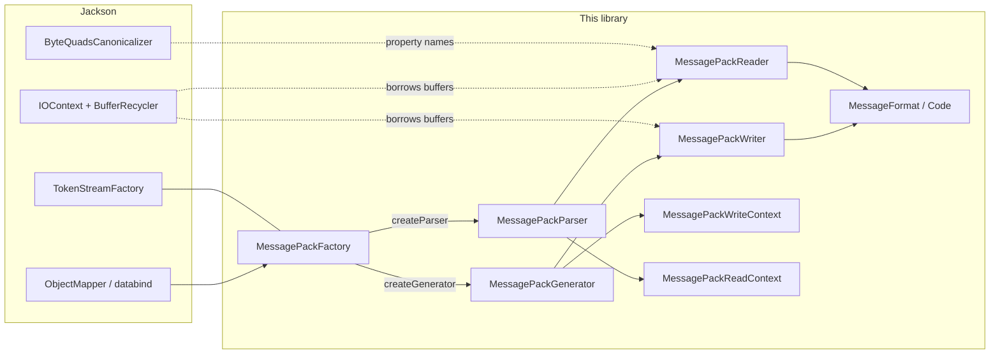
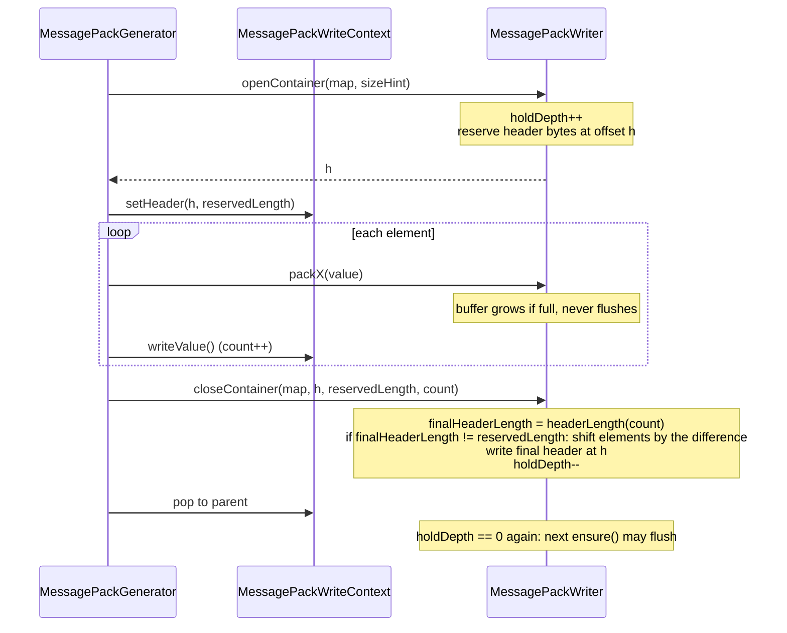
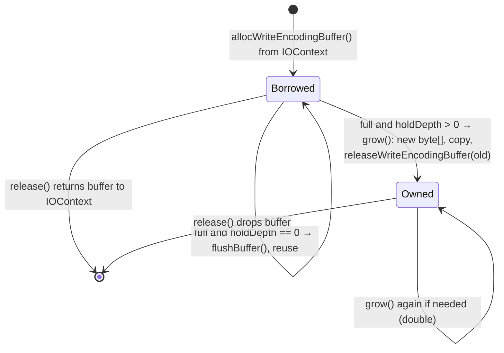
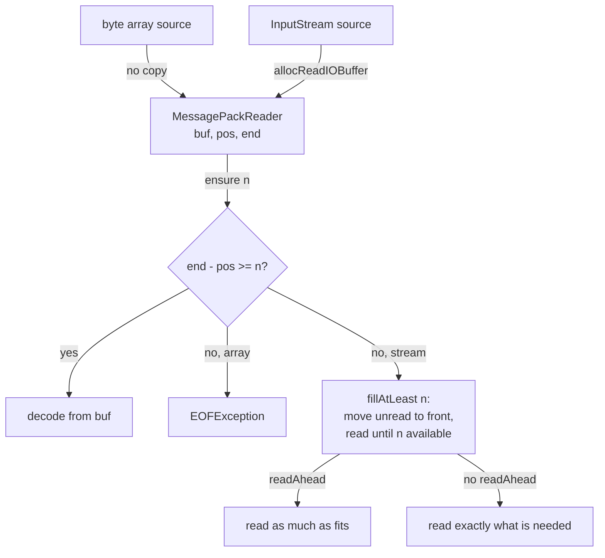
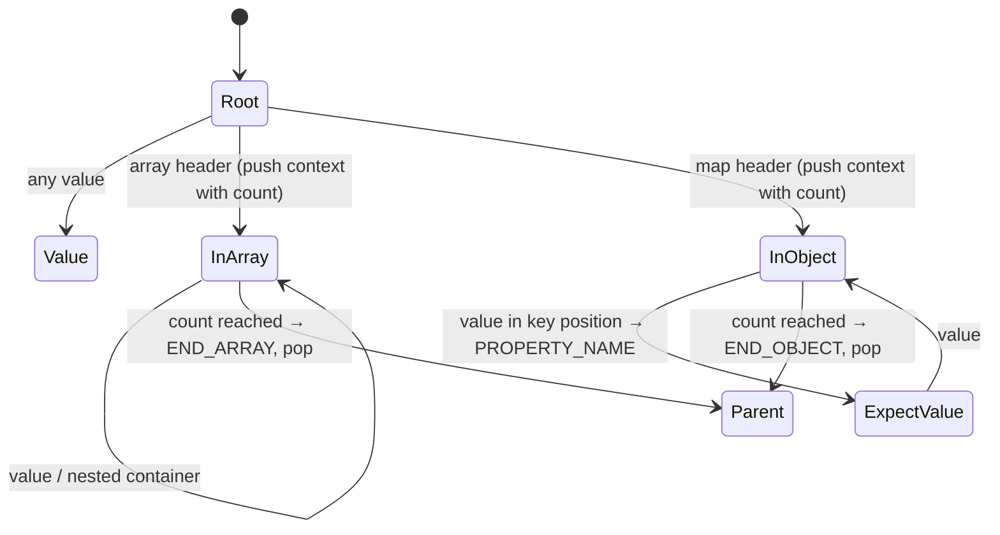

# Internal design

How the library encodes and decodes MessagePack on top of Jackson 3's streaming API. This is
for people changing the code; the README covers usage.

## 1. Class map

| Class | Role |
|---|---|
| `MessagePackFactory` / `MessagePackFactoryBuilder` | Jackson `TokenStreamFactory`. Owns the root symbol table and the format options (str8, integer keys, custom extension deserializers). |
| `MessagePackGenerator` | Jackson `JsonGenerator`. Maps write calls to writer calls and tracks the write context. |
| `MessagePackWriter` | Encodes values into a byte buffer and writes it to the `OutputStream`. Knows nothing about Jackson tokens. |
| `MessagePackWriteContext` | Jackson `TokenStreamContext` for writing: element counts, property-name state, header position of each open container. |
| `MessagePackParser` | Jackson `JsonParser`. Turns decoded values into tokens and holds the current value. |
| `MessagePackReader` | Decodes values from a byte array or an `InputStream` through a buffer. |
| `MessagePackReadContext` | Jackson `TokenStreamContext` for reading: expected element counts, current name. |
| `MessageFormat` / `Code` | The format-byte table of the MessagePack spec. |
| `MessagePackKeySerializer`, `MessagePackSerializedString` | Non-String map keys on the write side. |
| `TimestampExtensionModule`, `MessagePackExtensionType`, `ExtensionTypeCustomDeserializers` | Extension type (-1 timestamp, and user-defined types). |

msgpack-core is not used at runtime. It is a test dependency, used as the reference
implementation that every encoded and decoded value is compared against.

## 2. Write path

### 2.1 The problem: counted containers

A MessagePack array or map header carries the element count and precedes the elements.
Jackson's streaming API delivers elements one by one and only signals the end with
`writeEndArray`/`writeEndObject`. So the header cannot be final until the container closes,
and the bytes between the header and the close must still be in memory to patch it.

CBOR and Smile do not have this problem (CBOR has indefinite-length containers with a break
marker, Smile has start/end markers), which is why Jackson's own binary generators stream
every byte straight out and this one cannot.

### 2.2 Hold mode and header patching

`MessagePackWriter` keeps one output buffer. While no container is open, the buffer is
flushed to the stream whenever it fills. While a container is open (`holdDepth > 0`), the
buffer is never flushed; it grows instead, so the header stays reachable.

With no size hint, one byte is reserved (fixarray/fixmap, up to 15 elements). If the final
count needs a 3- or 5-byte header, the elements are shifted right once at close. With a size
hint (`writeStartArray(Object, int)`), the header for that size is written immediately and
close only patches it if the hint was wrong. Hints come from databind for collections of
known size and are used but not trusted: databind passes -1 when views or filters are
involved, and callers can be wrong.

Nested containers just nest: each level records its own header offset in its write context,
and `holdDepth` counts open levels. Everything from the outermost open container's header
onward is in the buffer until that container closes.

### 2.3 Buffer ownership

The initial buffer comes from Jackson's `BufferRecycler` (8000 bytes by default) so that a
generator per `writeValueAsBytes` does not allocate. `grow()` is only reached inside an open
container, when flushing is not allowed. The borrowed buffer is handed back the moment it is
replaced, and a buffer the writer allocated itself is never given to the pool (the pool
would then hand oversized arrays to other users). Small values never reach `grow()`.

Retained memory per idle thread is dominated by Jackson's own `ByteArrayBuilder` pooling,
not by this writer; see `jmh/results/2026-09-19-stage-b-own-wire-format.md`.

### 2.4 Strings

`packString` needs the UTF-8 byte length before it can write the header. Two paths:

- Up to 31 chars: encode in one pass directly after a one-byte fixstr header. 31 chars are at
  most 93 bytes, so if the result is 32 bytes or more the payload is shifted by one (str8) or
  two (str16, when str8 is disabled) bytes. This is the path every property name and most
  values take. `jmh/results/2026-09-21-single-pass-short-strings.md` shows the effect.
- Longer: `utf8Length` counts the bytes, the header is written, `encodeUtf8` writes the bytes.
  A string larger than the whole buffer falls back to `String.getBytes`.

`utf8Length` and `encodeUtf8` must agree with each other and with `String.getBytes(UTF_8)`:
an unpaired surrogate counts as one byte and is written as `?`.

### 2.5 Close semantics

`close()` with containers still open follows Jackson's `AUTO_CLOSE_CONTENT` (on by default):

- On: open containers are closed in order and the result is flushed. A property name with no
  value gets nil, so the output stays valid MessagePack.
- Off: the whole unfinished root value is discarded (`discardFrom(outermostHeaderOffset)`)
  and complete root values before it are flushed. Emitting the enclosing containers with
  partial counts would produce a valid-looking value that differs from what was written,
  which is worse than emitting nothing.

Exceptions thrown mid-value leave the generator consistent, because every check (nesting
depth, value expected) runs before any state is changed.

### 2.6 Complex map keys

A non-scalar map key (`MessagePackKeySerializer` on a POJO) is serialized by a nested
`MessagePackGenerator` that shares the parent's `MessagePackWriter`, so the key's containers
are patched in place inside the parent's buffer. The nested generator has its own write
context stack, seeded with the parent's nesting depth so `maxNestingDepth` still holds.

## 3. Read path

### 3.1 Sources and buffering

A byte-array source is decoded in place. A stream source borrows an 8000-byte buffer from
the `IOContext` and refills it on demand. `readAhead` is on unless `AUTO_CLOSE_SOURCE` is
disabled: then the caller may keep reading the stream after the parser is done, so the
reader must not consume bytes beyond the current value.

A payload larger than the buffer (a long string or binary) is read directly into its own
array with `readPayload`, never by growing the buffer.

### 3.2 Token state machine

`MessagePackParser._nextToken` decides what the next value means from the read context:

The read context knows the declared count of each container and reports END_ARRAY /
END_OBJECT when it is reached; there are no end markers in the stream. `isObjectValueSet`
(in an object and the last token was not PROPERTY_NAME) means the next value is a key.

Key handling by MessagePack type:

| Key type | Token | `currentName()` | Notes |
|---|---|---|---|
| str | PROPERTY_NAME | the string | canonicalized (3.3) |
| int / float / bool | PROPERTY_NAME | `String.valueOf` | `isCurrentFieldId()` tells a `KeyDeserializer` it was an integer |
| nil | PROPERTY_NAME | null | strict duplicate detection tracks a second nil key |
| bin | PROPERTY_NAME | UTF-8 decoding | raw bytes kept, `getBinaryValue()` returns them; not canonicalized |
| ext | PROPERTY_NAME | `toString()` of the deserialized value | |
| array / map | error | | no property name can represent it |

Values are decoded eagerly in `_nextToken` (numbers into the narrowest of int/long/BigInteger,
strings into a `String`), so the accessors only return fields. `nextToken()` after end of
input or after `close()` returns null and clears the current token.

### 3.3 Property-name canonicalization

Property names go through the same `ByteQuadsCanonicalizer` that Jackson's JSON, CBOR and
Smile parsers use. The factory owns a root table; each parser gets a child, which is merged
back into the root on close. A name's raw UTF-8 bytes are packed into 4-byte quads and looked
up before any decoding; a hit returns the existing `String`, a miss decodes once and adds it.
Values are never canonicalized. `TokenStreamFactory.Feature.CANONICALIZE_PROPERTY_NAMES`
turns it off.

Two edge cases:

- A short name's last quad is padded with 0xff bytes. 0xff never occurs in valid UTF-8, but
  the reader accepts malformed input, so a name that really contains 0xff could collide with
  a padded one. Such names are detected from the quads already computed and decoded without
  the table.
- A name longer than the whole read buffer is decoded like a string and kept out of the
  shared table, where it would only take up space.

Effect: `readPojoMsgpack` allocates 2024 bytes per operation against 2096 for Jackson's JSON
read of the same POJO (`jmh/results/2026-09-20-stage-d-name-canonicalization.md`).

## 4. Constraints and hostile input

`StreamReadConstraints` and `StreamWriteConstraints` from the factory are enforced:

| Constraint | Where |
|---|---|
| `maxStringLength` | string, binary and extension values: checked against the declared length before anything is allocated |
| `maxNameLength` | the same three in key position |
| `maxNestingDepth` (read) | on every array/map header |
| `maxNestingDepth` (write) | in `writeStartArray`/`writeStartObject`, before the context or the count is touched |
| `maxNumberLength` | not applicable, MessagePack numbers are fixed-size |

Rules the reader follows: a declared length is checked before allocating for it; a declared
container count is never used to pre-size anything (a 5-byte input can claim 2^31 elements);
the reserved format byte 0xc1 and any format in the wrong position (a container as a key)
are reported as `StreamReadException`, never as an unchecked exception. Timestamp nanosecond
fields above 999999999 are rejected instead of being folded into the seconds.
`HostileInputTest` pins these.

## 5. Format decisions

- **str8**: written for strings of 32 to 255 bytes unless `str8FormatSupport` is off, then
  str16. Readers accept both regardless.
- **Integer keys**: with `supportIntegerKeys`, `writePropertyId(long)` writes the key as an
  integer; otherwise as its decimal string. On the read side an integer key is always exposed
  as a string name with `isCurrentFieldId()` set.
- **BigInteger**: int64/uint64 when it fits, otherwise `IllegalArgumentException` (there is no
  bigger MessagePack integer). **BigDecimal**: written as an integer if it has no fraction,
  else as a double if that is exact, else `IllegalArgumentException`.
  `MessagePackMapper.Builder.handleBigIntegerAndBigDecimalAsString()` switches both to strings.
- **Timestamps**: extension type -1 in the 32-, 64- or 96-bit form, the smallest that fits.
  `TimestampExtensionModule` maps `Instant`.
- **Other extension types**: `MessagePackExtensionType` (type byte plus payload), with
  `ExtensionTypeCustomDeserializers` for turning a type into a Java object on read.
- **Null arguments**: `writeString(null)`, `writeNumber((BigInteger) null)` and the like
  write nil, as Jackson's own generators do.
- **Duplicate keys**: `STRICT_DUPLICATE_DETECTION` uses Jackson's `DupDetector` for string
  names and a flag for nil; distinct keys that print alike (`1` and `"1"`) collide, as in
  Jackson's CBOR generator.

## 6. Testing

- `MessagePackWriterTest` / `MessagePackReaderTest`: every value kind at every format
  boundary, compared byte for byte with msgpack-core's `MessagePacker` and decoded from its
  output, for both str8 settings and for array and stream sources.
- `MessagePackGeneratorTest` / `MessagePackParserTest`: the Jackson layer, including close
  semantics, contexts, complex keys and the accessor contract.
- `HostileInputTest`: inputs that claim huge sizes or depths must fail with a bounded, typed
  exception without allocating in proportion to the claim.
- `PropertyNameCanonicalizationTest`, `NestedUsageTest` (re-entrant `ObjectMapper` use on one
  thread), `NonAsciiTextTest` (the test JVM runs with a non-UTF-8 default charset so any
  charset-less conversion shows up).
- Benchmarks: `./gradlew :jmh:jmh`, with `-PjmhIncludes=<regex>` and `-PjmhProfilers=gc`.
  Results and the reasoning behind each performance change are in `jmh/results/`.
